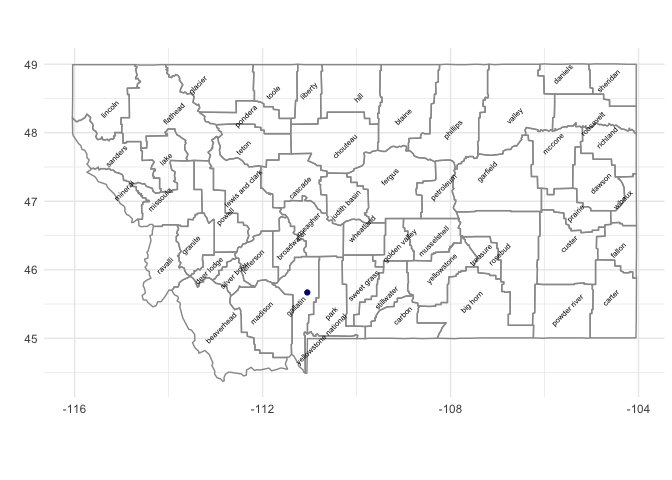
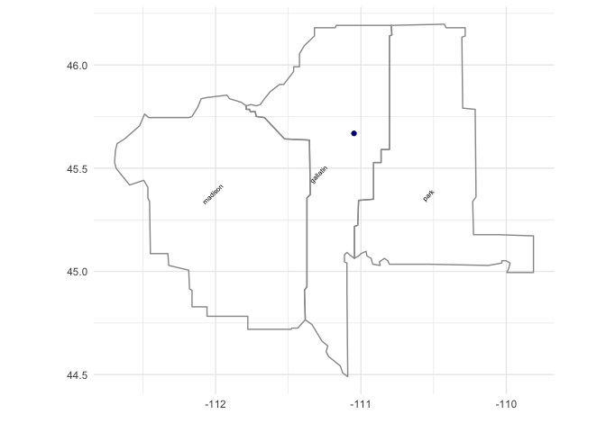
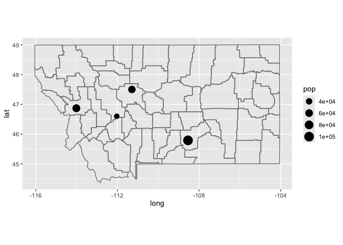
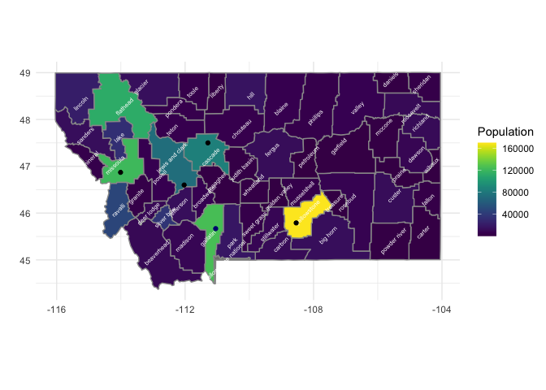
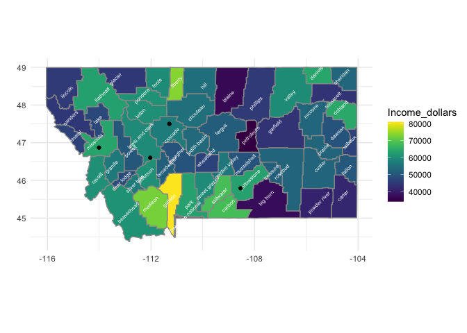
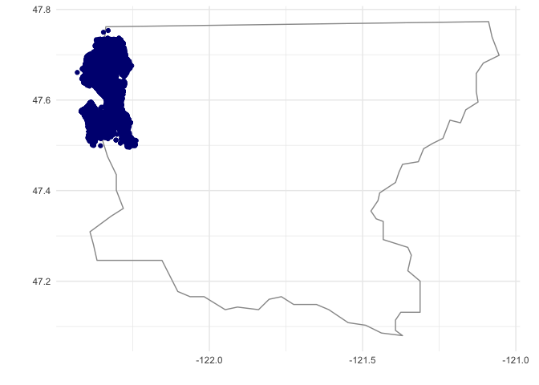
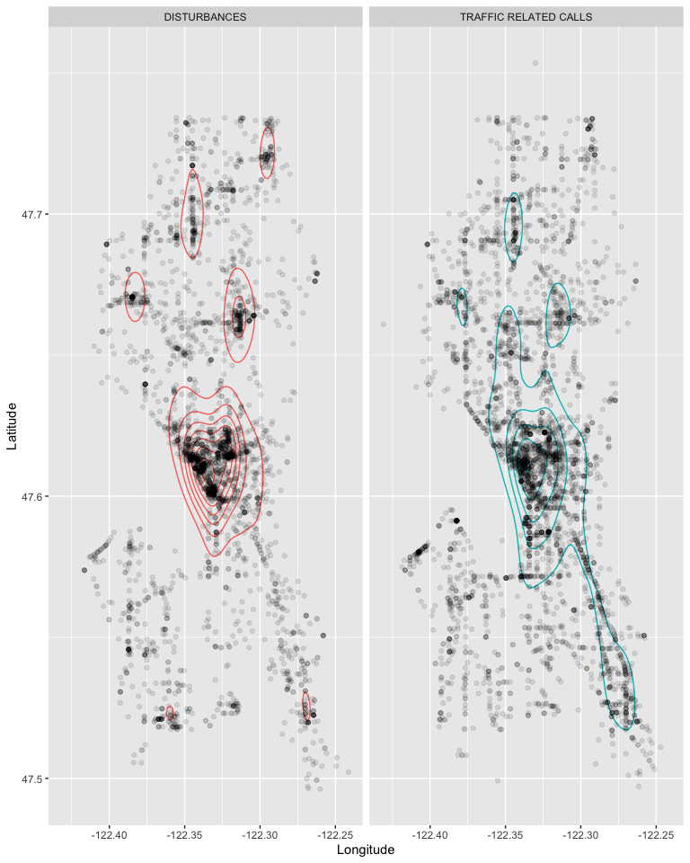
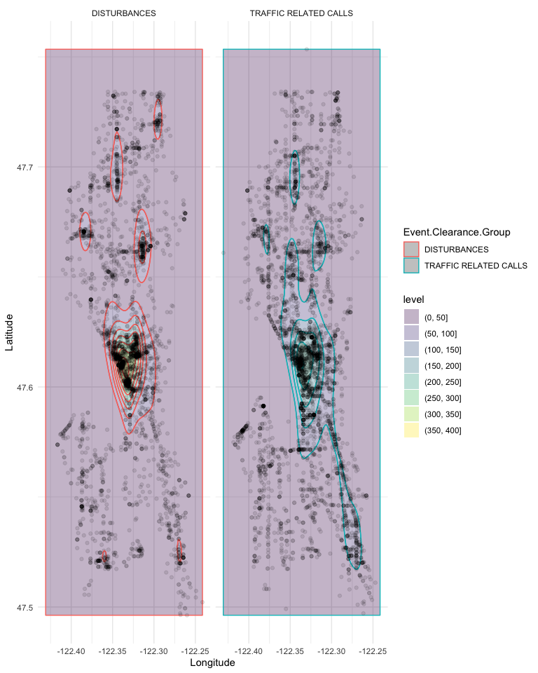
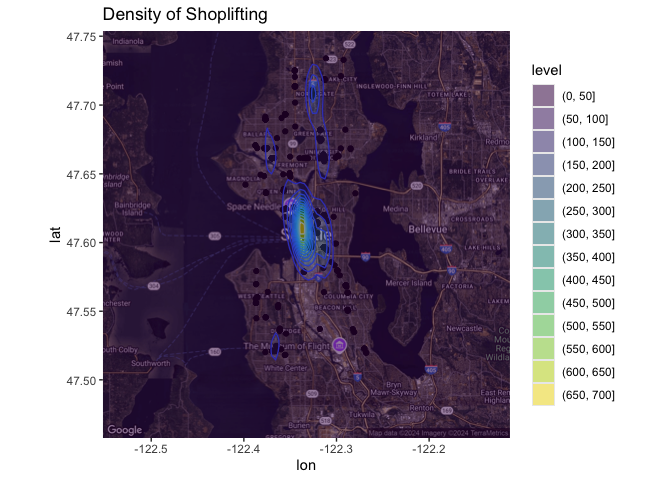
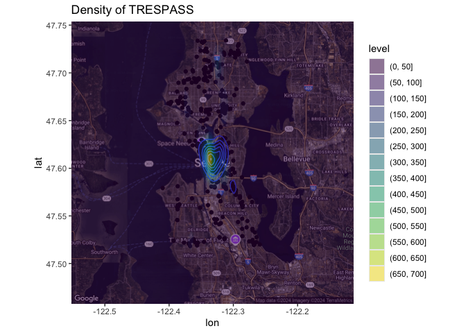

# Static Map in R


Creating static maps in R, which ggplot, requires downloading map
layers.

## 1. Downloading Map Layers

### ggmap

ggmap is a nice way to download map layers, including satellite images.
Unfortunately, `ggmap` now requires a Google Maps API key. The
`get_map()` function relies on Google to draw the appropriate map. The
API is free up to a reasonable limit, but then does end up costing. To
get the key, you’ll have to enter credit card information. I do this for
my own work, but we will avoid that for classroom examples. If you’d
like high resolution base layers for your project, look into this
option.

``` r
library(ggmap)

bozo_map <- get_map(location = 'bozeman')
```

    Error: Google now requires an API key.
           See ?register_google for details.

### maps

As we saw with leaflet, we can use the `maps` package to download maps
too. There are county, state, and country level maps for the US as well
as a few other countries.

``` r
mt <- map_data("county", "montana")
head(mt)
```

           long      lat group order  region  subregion
    1 -113.5373 45.90538     1     1 montana beaverhead
    2 -113.4915 45.88246     1     2 montana beaverhead
    3 -113.4399 45.84235     1     3 montana beaverhead
    4 -113.3826 45.74495     1     4 montana beaverhead
    5 -113.3540 45.76214     1     5 montana beaverhead
    6 -113.3482 45.80798     1     6 montana beaverhead

``` r
centroids <- mt |>
  group_by(subregion) |>
  summarize(lat = mean(lat), 
            long = mean(long))

wilson_hall <- tibble(long = -111.048, lat = 45.66845)

mt |>
  ggplot( aes(x = long, y = lat)) +
  geom_polygon(aes(group = group), fill = NA, colour = "grey60") +
  theme_minimal() +
  geom_text(aes(label = subregion), data = centroids, size = 2, angle = 45) +
  geom_point(data = wilson_hall, color = 'navy') +
  coord_quickmap() +
  xlab('') +
  ylab('')
```



``` r
centroids <- mt |>
  group_by(subregion) |>
  summarize(lat = mean(lat), 
            long = mean(long))

wilson_hall <- tibble(long = -111.048, lat = 45.66845)

mt |> filter(subregion %in% c('gallatin', 'park', 'madison')) |>
  ggplot( aes(x = long, y = lat)) +
  geom_polygon(aes(group = group), fill = NA, colour = "grey60") +
  theme_minimal() +
  geom_text(aes(label = subregion), 
            data = centroids |> 
              filter(subregion %in% c('gallatin', 'park', 'madison')),
            size = 2, angle = 45) +
  geom_point(data = wilson_hall, color = 'navy') +
  coord_quickmap() +
  xlab('') +
  ylab('')
```



``` r
data(us.cities)
head(us.cities)
```

            name country.etc    pop   lat    long capital
    1 Abilene TX          TX 113888 32.45  -99.74       0
    2   Akron OH          OH 206634 41.08  -81.52       0
    3 Alameda CA          CA  70069 37.77 -122.26       0
    4  Albany GA          GA  75510 31.58  -84.18       0
    5  Albany NY          NY  93576 42.67  -73.80       2
    6  Albany OR          OR  45535 44.62 -123.09       0

``` r
us.cities |>
  filter(country.etc == 'MT') |> 
  ggplot(aes(long, lat)) +
    borders("county", 'montana') +
    geom_point(aes(size = pop)) +
    scale_size_area() +
    coord_quickmap() 
```



``` r
mt_income <- read_csv('https://raw.githubusercontent.com/stat408/Data/refs/heads/main/MT_Income.csv'); mt_income
```

    Rows: 2968 Columns: 10
    ── Column specification ────────────────────────────────────────────────────────
    Delimiter: ","
    chr (6): Area, Income Type, Source, Period Type, State Name, Income
    dbl (3): ID, Year, Income Rank
    num (1): Population

    ℹ Use `spec()` to retrieve the full column specification for this data.
    ℹ Specify the column types or set `show_col_types = FALSE` to quiet this message.

    # A tibble: 2,968 × 10
           ID Area       Year `Income Type` Source `Period Type` `State Name` Income
        <dbl> <chr>     <dbl> <chr>         <chr>  <chr>         <chr>        <chr> 
     1 536483 Beaverhe…  2022 Per capita i… BEA    Annual        Montana      $60,9…
     2 536495 Yellowst…  2022 Per capita i… BEA    Annual        Montana      $63,5…
     3 536501 Valley     2022 Per capita i… BEA    Annual        Montana      $59,5…
     4 536503 Wheatland  2022 Per capita i… BEA    Annual        Montana      $46,6…
     5 536505 Wibaux     2022 Per capita i… BEA    Annual        Montana      $46,5…
     6 536507 Teton      2022 Per capita i… BEA    Annual        Montana      $60,1…
     7 536509 Toole      2022 Per capita i… BEA    Annual        Montana      $59,6…
     8 536511 Treasure   2022 Per capita i… BEA    Annual        Montana      $51,5…
     9 536513 Silver B…  2022 Per capita i… BEA    Annual        Montana      $56,5…
    10 536515 Stillwat…  2022 Per capita i… BEA    Annual        Montana      $68,1…
    # ℹ 2,958 more rows
    # ℹ 2 more variables: `Income Rank` <dbl>, Population <dbl>

1.  Use the MT income dataset to create a choropleth with county
    population Montana. Do the same for Income

``` r
mt_income |> 
  filter(Year == 2022) |>
  mutate(subregion = tolower(Area)) |>
  right_join(mt, by = join_by(subregion)) |>
   ggplot( aes(x = long, y = lat)) +
  geom_polygon(aes(group = group, fill = Population), colour = "grey60") +
  theme_minimal() +
  geom_text(aes(label = subregion), data = centroids, size = 2, angle = 45, color = 'white') +
  geom_point(data = wilson_hall, color = 'navy') +
  coord_quickmap() +
  xlab('') +
  ylab('') + 
  scale_fill_viridis() +
  geom_point(data = us.cities |> filter(country.etc == 'MT'))
```



``` r
mt_income |> 
  filter(Year == 2022) |>
  mutate(subregion = tolower(Area)) |>
  mutate(Income_dollars = parse_number(Income)) |>
  right_join(mt, by = join_by(subregion)) |>
   ggplot( aes(x = long, y = lat)) +
  geom_polygon(aes(group = group, fill = Income_dollars), colour = "grey60") +
  theme_minimal() +
  geom_text(aes(label = subregion), data = centroids, size = 2, angle = 45, color = 'white') +
  coord_quickmap() +
  xlab('') +
  ylab('') + 
  scale_fill_viridis() +
  geom_point(data = us.cities |> filter(country.etc == 'MT'))
```



``` r
seattle <- read_csv('http://math.montana.edu/ahoegh/teaching/stat408/datasets/Seattle_911_062016.csv') 
```

    Rows: 23102 Columns: 22
    ── Column specification ────────────────────────────────────────────────────────
    Delimiter: ","
    chr (13): Event.Clearance.Code, Event.Clearance.Description, Event.Clearance...
    dbl  (9): CAD.CDW.ID, CAD.Event.Number, General.Offense.Number, Census.Tract...

    ℹ Use `spec()` to retrieve the full column specification for this data.
    ℹ Specify the column types or set `show_col_types = FALSE` to quiet this message.

``` r
wa <- map_data("county", "Washington")
head(wa)
```

           long      lat group order     region subregion
    1 -118.2356 46.73617     1     1 washington     adams
    2 -119.3700 46.74190     1     2 washington     adams
    3 -119.3700 46.74190     1     3 washington     adams
    4 -119.3757 46.90232     1     4 washington     adams
    5 -118.9804 46.90805     1     5 washington     adams
    6 -118.9804 47.25756     1     6 washington     adams

``` r
wa |> filter(subregion %in% c('king')) |>
  ggplot( aes(x = long, y = lat)) +
  geom_polygon(aes(group = group), fill = NA, colour = "grey60") +
  theme_minimal() +
  geom_point(data = seattle |> rename(lat = Latitude, long = Longitude), color = 'navy') +
  coord_quickmap() +
  xlab('') +
  ylab('')
```



2.  Explore the `geom_density2d` and `geom_density_2d_filled` functions
    with the seattle 911 calls.

``` r
common_crimes <- seattle |>
  count(Event.Clearance.Group) |>
  filter(n > 1000) |>
  arrange(desc(n))

common_crimes |>
  kable()
```

| Event.Clearance.Group                 |    n |
|:--------------------------------------|-----:|
| TRAFFIC RELATED CALLS                 | 4183 |
| DISTURBANCES                          | 3419 |
| SUSPICIOUS CIRCUMSTANCES              | 3217 |
| MOTOR VEHICLE COLLISION INVESTIGATION | 1583 |
| LIQUOR VIOLATIONS                     | 1138 |
| FALSE ALACAD                          | 1073 |

``` r
seattle |>
   filter(Event.Clearance.Group %in% c('DISTURBANCES', 'TRAFFIC RELATED CALLS')) |>
  ggplot(aes(y = Latitude, x = Longitude)) +
  geom_density2d(inherit.aes = F, aes(y = Latitude, x = Longitude, colour = Event.Clearance.Group)) +
  geom_point(alpha = .1) +
  facet_wrap(vars(Event.Clearance.Group), ncol = 2) +
  theme(legend.position = 'none')
```



``` r
seattle |>
   filter(Event.Clearance.Group %in% c('DISTURBANCES', 'TRAFFIC RELATED CALLS')) |>
  ggplot(aes(y = Latitude, x = Longitude)) +
  geom_density_2d_filled(inherit.aes = F, aes(y = Latitude, x = Longitude, colour = Event.Clearance.Group), alpha = .3) +
  geom_point(alpha = .1) +
  facet_wrap(vars(Event.Clearance.Group), ncol = 2) +
  theme(legend.position = 'none') + 
  theme_minimal()
```



**need to use `register_google()` to take advantage of `get_map`
features.**

``` r
seattle_map <- get_map( "seattle", zoom = 11, maptype = "hybrid")
```

    Source : https://maps.googleapis.com/maps/api/staticmap?center=seattle&zoom=11&size=640x640&scale=2&maptype=hybrid&language=en-EN&key=xxx

    Source : https://maps.googleapis.com/maps/api/geocode/json?address=seattle&key=xxx

``` r
ggmap(seattle_map) + 
  geom_point(data = seattle |> filter(Event.Clearance.Description == 'SHOPLIFT'),
             aes( y = Latitude, x = Longitude)) +
  geom_density2d(data = seattle |> filter(Event.Clearance.Description == 'SHOPLIFT'),
             aes( y = Latitude, x = Longitude)) +
  geom_density_2d_filled(data = seattle |> filter(Event.Clearance.Description == 'SHOPLIFT'), aes( y = Latitude, x = Longitude), alpha = 0.5) +
  labs(title = 'Density of Shoplifting')
```



``` r
ggmap(seattle_map) + 
  geom_point(data = seattle |> filter(Event.Clearance.Description == 'TRESPASS'),
             aes( y = Latitude, x = Longitude)) +
  geom_density2d(data = seattle |> filter(Event.Clearance.Description == 'TRESPASS'),
             aes( y = Latitude, x = Longitude)) +
  geom_density_2d_filled(data = seattle |> filter(Event.Clearance.Description == 'SHOPLIFT'), aes( y = Latitude, x = Longitude), alpha = 0.5) +
  labs(title = 'Density of TRESPASS')
```



3.  Embed a shiny app to create a heat map by a selected factor with the
    seattle 911 data

``` r
selectInput("type_911", "Choose a 911 call type:", 
            c("DISTURBANCES" = "DISTURBANCES",
              'LIQUOR VIOLATIONS' = 'LIQUOR VIOLATIONS',
              'TRAFFIC RELATED CALLS' = 'TRAFFIC RELATED CALLS',
              'SUSPICIOUS CIRCUMSTANCES' = 'SUSPICIOUS CIRCUMSTANCES'),
               selected = "DISTURBANCES")
plotOutput("heatmap", width = "600px", height = "800px" )
```

``` r
output$heatmap <- renderPlot({
  library(tidyverse)
 
 seattle <- read_csv('http://math.montana.edu/ahoegh/teaching/stat408/datasets/Seattle_911_062016.csv') 

 seattle |>
   filter(Event.Clearance.Group %in% input$type_911) |>
  ggplot(aes(y = Latitude, x = Longitude)) +
  geom_density_2d_filled(inherit.aes = F, aes(y = Latitude, x = Longitude), alpha = .3) +
  geom_point(alpha = .1) +
  theme(legend.position = 'none') + 
  theme_minimal() +
  labs(title = paste("Heat map for ", input$type_911))


})
```
